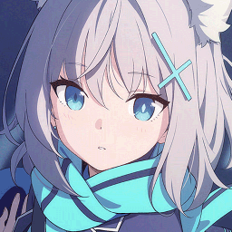
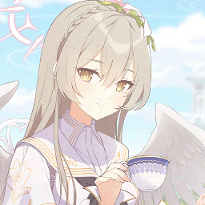

<link rel="stylesheet" href="../public/assets/css/button.css">
<link rel="stylesheet" href="../public/assets/css/card.css">

<h1>关于项目</h1>

> 

> GitHub 项目主页：
> <a href="https://github.com/bluearchive-cafe" target="_blank" rel="noopener">bluearchive-cafe</a>
> 

交流
游戏与汉化交流

<a href="https://pd.qq.com/s/dwb725e6u?b=5" class="color" title="点击跳转" target="_blank" rel="noopener">

QQ 频道
</a>
<a href="https://qm.qq.com/q/KNws63nrQ6" class="color" title="点击跳转" target="_blank" rel="noopener">

QQ 群聊
</a>

支持
请我们喝杯咖啡

<a href="https://afdian.com/a/beichen1234" class="color" title="点击跳转" target="_blank" rel="noopener">

爱发电
</a>
<a data-page="support" href="https://bluearchive.cafe/support" class="color" title="点击跳转">

哔哩充电
</a>

