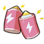

<link rel="stylesheet" href="../public/assets/css/button.css">

<h1>关于支持</h1>

> 感谢老师对汉化项目的支持，在此之前，有一些事项希望您了解

根据
<strong>
<a href="https://www.bilibili.com/blackboard/help.html#/?qid=380" title="点击跳转"
target="_blank" rel="noopener">哔哩哔哩充电计划
</a>
</strong>
，UP 主充电收益为：

- 充电收入

  - 平台抽成

    - 哔哩哔哩 `(30%)`

  - 第三方抽成

    - App Store `(30%)`

    - 支付平台、应用商店等 `(<5%)`

- 实际充电收益约为充电收入总额的 `60%`

因此，我们不推荐老师进行大额充电，推荐移步至其他平台进行支持

> 本项目完全免费，支持项目遵循自愿原则，不便之处，敬请谅解！

<a href="https://afdian.com/a/beichen1234" class="color doc" title="点击跳转" target="_blank" rel="noopener">

爱发电
</a>
<a href="https://b23.tv/cJiBl53" class="color doc" title="点击跳转" target="_blank" rel="noopener">

哔哩充电
</a>

